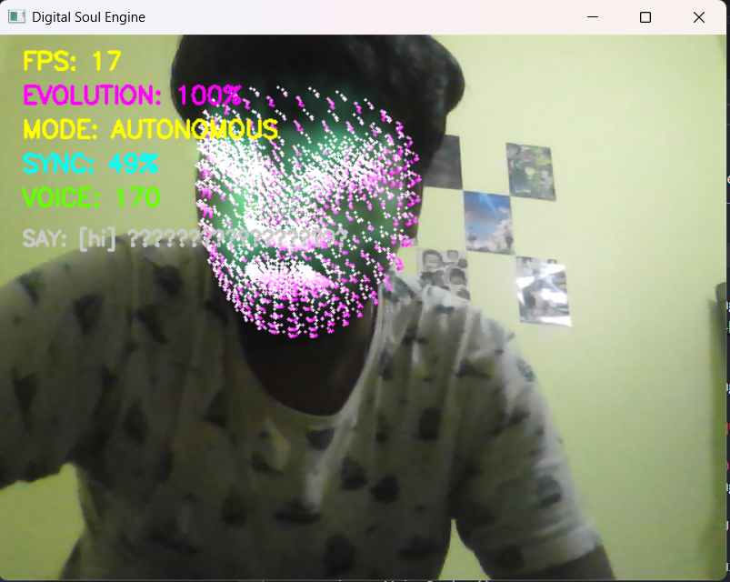

Digital Soul Engine
====================

Run a realtime evolving "digital clone" that uses your webcam, voice, and behaviour to build a personality over time.

Quick start
-----------

1. Create and activate a virtualenv in the workspace root (optional but recommended):

```powershell
python -m venv .venv
.\.venv\Scripts\Activate.ps1
```

2. Install requirements inside `Day_7` venv (or global):

```powershell
pip install -r requirements.txt
```

3. Run the demo:

```powershell
python main.py
```

Notes
-----
- Speech recognition supports Hindi (`hi-IN`) and English (`en-US`) via Google Speech API (requires network access).
- TTS uses `pyttsx3` by default; `gTTS` is included for optional Hindi voice samples.
- Camera must be available. Press `ESC` to quit and `r` to reset evolution.

Structure
---------
- `vision.py` — mediapipe face tracking
- `voice.py` — microphone input + speech recognition
- `memory.py` — stores recent behaviour history
- `prediction.py` — predicts future landmark positions
- `evolution.py` — evolution engine and autonomous actions
- `renderer.py` — visual renderer (particles/wireframe)

Roadmap
-------
This project is scaffolded for a 30-day content series. The repo already contains the Stage 1–3 building blocks; continue by iterating on visuals, reaction logic, and content hooks.
